# INFORME PRACTICA 9
## Sistema de ficheros y creación de procesos en Node.js
### ALBERTO RIOS DE LA ROSA
### alu0101235929@ull.edu.es

### INTRODUCCIÓN

Esta práctica tiene como objetivo principal seguir trabajando con el sistema de ficheros y la creacion de procesos en Node.js, donde se plantearan una serie de ejercicios o retos a resolver haciendo uso de las APIs proporcionadas, para así seguir evolucionando en nuestro aprendizaje en la materia. Al igual que las anteriores practicas se deberá desarrollar la documentación y la realización de pruebas mediante la metodología TDD, ademas del gitHub Acctions y del sonar cloud. Primero explicaremos en un principio como crear este método de manera breve, y más tarde mostraremos la solución de cada uno de los ejercicios propuestos, que al tener varios ficheros cada ejercicio se encontrará resuelto en una carpeta dentro de la src para cada ejercicio, con una breve explicación de cada uno y unas capturas de pantalla en el que se muestra que se han superado las distintas pruebas de ese ejercicio junto al link de donde se crearon las pruebas. Si desea leer los enunciados de cada ejercicio los podrás encontrar pinchando [aqui](https://ull-esit-inf-dsi-2021.github.io/prct08-filesystem-notes-app/)

### CREACION DEL PROYECTO CON LA ESTRUCTURA REQUERIDA

Para crear el proyecto primero debemos realizar un git clone, de la estructura de git dada para el desarrollo y la entrega del mismo, mas tarde al igual que la práctica anterior debemos seguir los pasos de la creacion de un proyecto para trabajar en TypeScript a partir del siguiente [enlace](https://ull-esit-inf-dsi-2021.github.io/typescript-theory/typescript-project-setup.html). Ya creado el proyecto inicial, lo siguiente que vamos a crear es los ficheros y carpetas necesarios para poder elaborar la documentación de cada uno de los ejercicios, encontrandolos en este [video](https://drive.google.com/file/d/19LLLCuWg7u0TjjKz9q8ZhOXgbrKtPUme/view). Después, a través de mocha y chai, crearemos lo necesario para poder seguir la metodología TDD, en el que se desarrolla la prueba y luego el método, teniendolo disponible en este [video](https://drive.google.com/file/d/1-z1oNOZP70WBDyhaaUijjHvFtqd6eAmJ/view). Por últimon hbará que realizar el cubrimiento de código a traves de gitHub Actions y de la calidad y seguridad del código fuente mediante Sonar Cloud.

### ELABORACIÓN DE LOS EJERCICIOS

### Ejercicio 1.

 - ___Fichero con el código resuelto___ = [Solución](https://github.com/ULL-ESIT-INF-DSI-2021/ull-esit-inf-dsi-20-21-prct09-async-fs-process-Espinette/blob/master/src/ejercicio1.ts)
 
 - ___Explicación___

En este ejercicio se nos pedía realizar traza de ejecución , paso a paso, el contenido de la pila de llamadas, el registro de eventos de la API y la cola de manejadores de Node.js, además de lo que se muestra por la consola, además se nos pedía como mínimo, dos modificaciones del fichero helloworld.txt a lo largo de la ejecución del siguiente programa:

```typescript
import {access, constants, watch} from 'fs';

if (process.argv.length !== 3) {
  console.log('Please, specify a file');
} else {
  const filename = process.argv[2];

  access(filename, constants.F_OK, (err) => {
    if (err) {
      console.log(`File ${filename} does not exist`);
    } else {
      console.log(`Starting to watch file ${filename}`);

      const watcher = watch(process.argv[2]);

      watcher.on('change', () => {
        console.log(`File ${filename} has been modified somehow`);
      });

      console.log(`File ${filename} is no longer watched`);
    }
  });
}
```

La traza explicada se encuentra en el link mostrado anteriormente. Por otro lado se nos pedía responder a un par de cuestiones:

   - ¿Qué hace la función access?: prueba los permisos de un usuario para un archivo o directorio junto a la ruta del mismo que se le pasa a la función
   - ¿Para qué sirve el objeto constants?: sirve para realizar las operaciones del sistema de archivos, ya que contiene las constantes de uso común en estas. 

### Ejercicio 2.

 - ___Fichero con el código resuelto___ = [Solución](https://github.com/ULL-ESIT-INF-DSI-2021/ull-esit-inf-dsi-20-21-prct09-async-fs-process-Espinette/blob/master/src/ejercicio2.ts)

 - ___Explicación___

En este ejercicio habia que realizar dos funciones que proporcionen información sobre el número de líneas, palabras o caracteres que contiene un fichero de texto, teniendo que ser el fichero que recibe un parámetro pasado a la aplicacion desde la linea de comandos. Una función debe hacer uso del metodo pipe mientras que la otra no debe usar el método pipe.

Función con Pipe:

 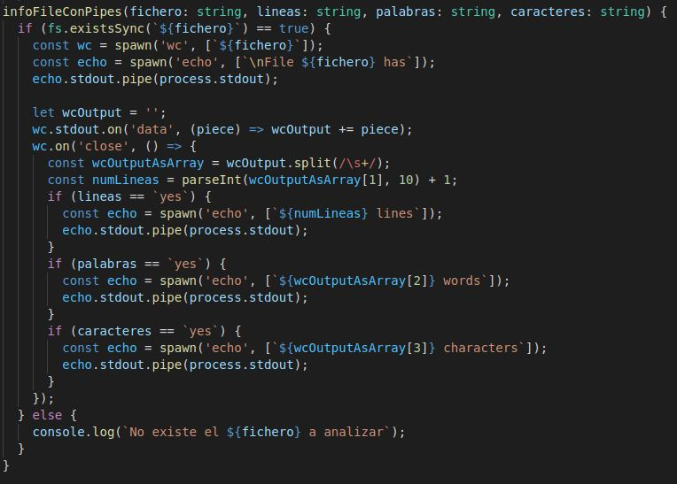
 
Función sin Pipe:

 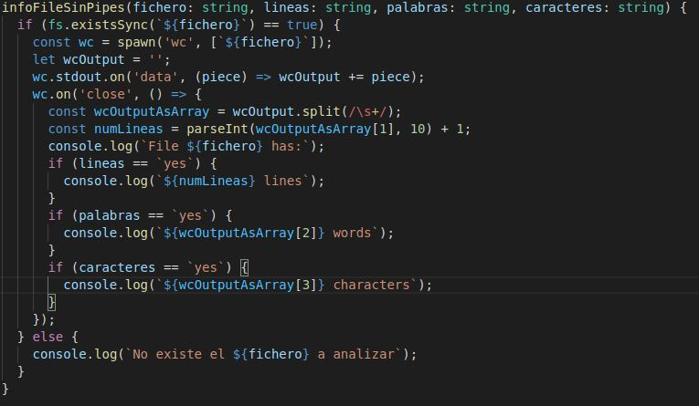
 
 - ___Ejemplo de ejcución___

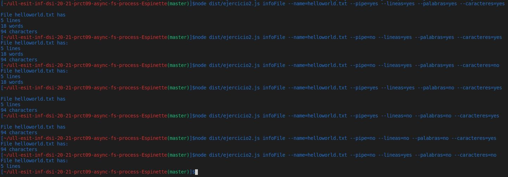

### Ejercicio 3.

 - ___Carpeta con el código resuelto___ = [Solución](https://github.com/ULL-ESIT-INF-DSI-2021/ull-esit-inf-dsi-20-21-prct09-async-fs-process-Espinette/tree/master/src/ejercicio3)

 - ___Explicación___

En este ejercicio se nos pedía que a partir de nuestra [práctica 8](https://github.com/ULL-ESIT-INF-DSI-2021/ull-esit-inf-dsi-20-21-prct08-filesystem-notes-app-Espinette/tree/master/src/practica8) realizar una aplicación que reciba desde la línea de comandos el nombre de un usuario de la aplicación de notas, así como la ruta donde se almacenan las notas de dicho usuario, debiendo controlar os cambios realizados sobre todo el directorio especificado al mismo tiempo que dicho usuario interactúa con la aplicación de procesamiento de notas. Siendo nuestra aplicación desarrollada la siguiente:

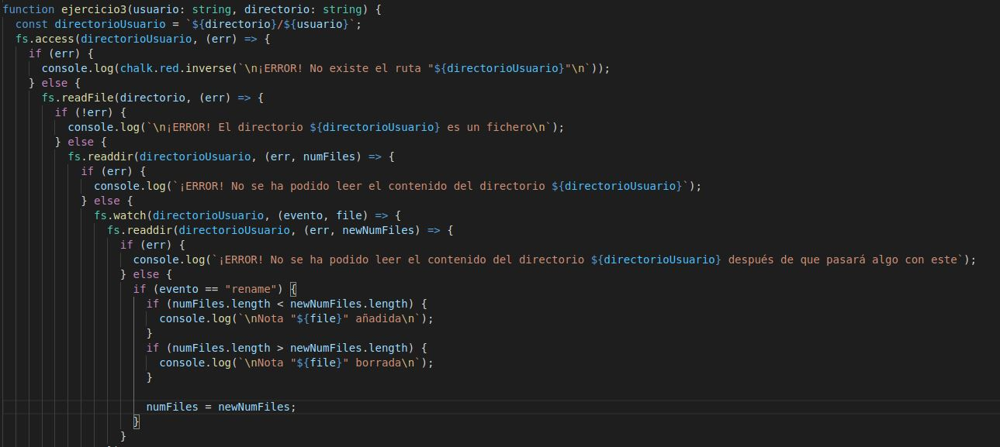

 - ___Ejemplo de ejcución___

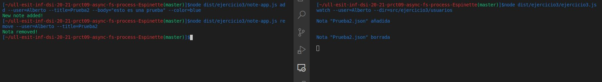

### Ejercicio 4.

 - ___Fichero con el código resuelto___ = [Solución](https://github.com/ULL-ESIT-INF-DSI-2021/ull-esit-inf-dsi-20-21-prct09-async-fs-process-Espinette/blob/master/src/ejercicio4.ts)

 - ___Explicación___

Para este ejercicio se nos pedía desarrollar una aplicación que permita hacer de wrapper de los distintos comandos empleados en Linux para el manejo de ficheros y directorios. a continuación mostraremos lo que se nos pedía realizar y su correspondiente solución realizada:

  - Dada una ruta concreta, mostrar si es un directorio o un fichero.
  
  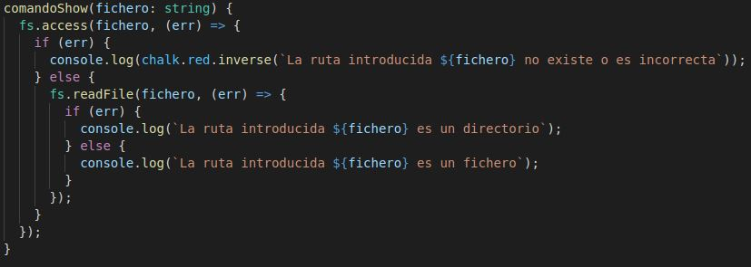
  
  - Crear un nuevo directorio a partir de una nueva ruta que recibe como parámetro.
  
  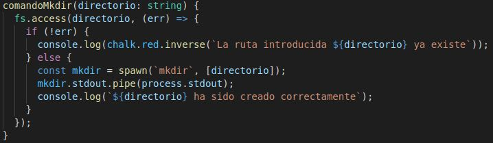

  - Listar los ficheros dentro de un directorio.

  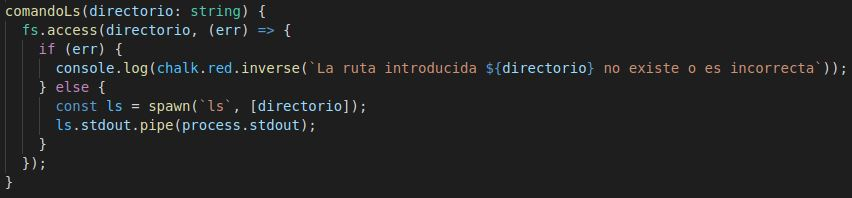

  - Mostrar el contenido de un fichero (similar a ejecutar el comando cat).

  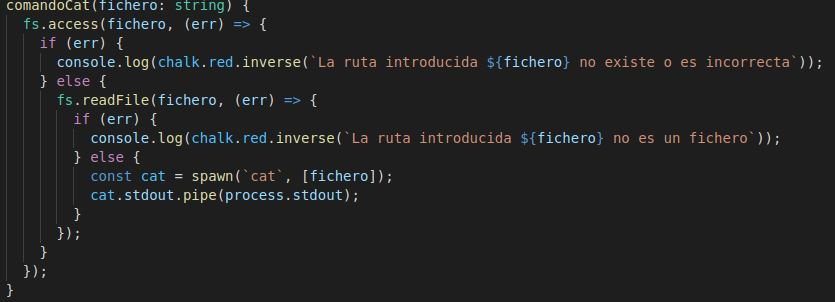

  - Borrar ficheros y directorios.

  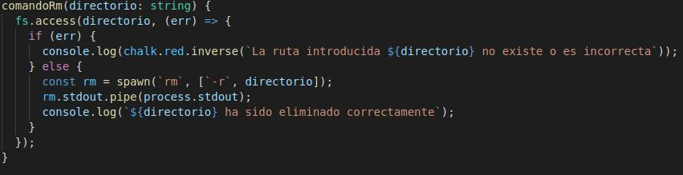

  - Mover y copiar ficheros y/o directorios de una ruta a otra. Para este caso, la aplicación recibirá una ruta origen y una ruta destino. En caso de que la ruta origen represente un directorio, se debe copiar dicho directorio y todo su contenido a la ruta destino.

  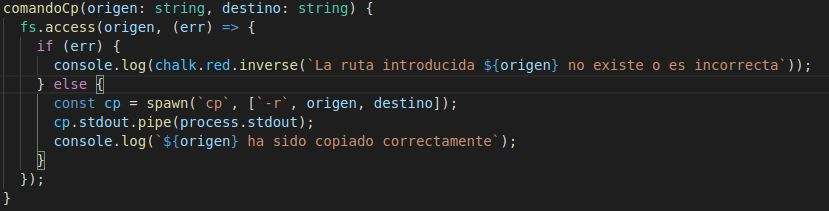

 - ___Ejemplo de ejcución___
 
   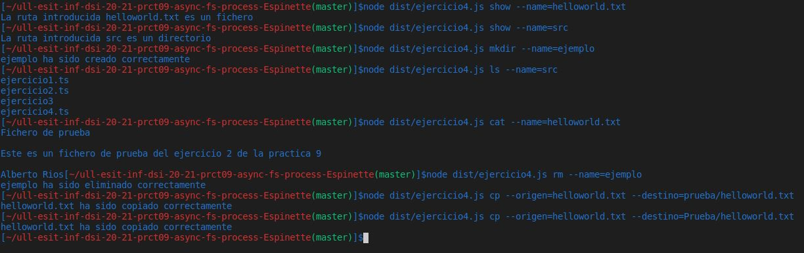

